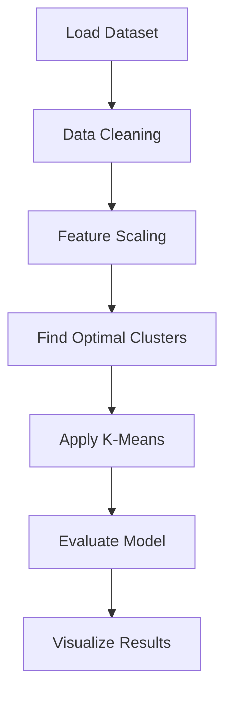

# 🚀 Customer Segmentation using K-Means

  
  
  
  

---

## 📌 Overview

* Customer segmentation using K-Means clustering
* Groups customers based on behavior patterns
* Supports data-driven marketing decisions

---

## ⚡ Features

* 🧹 Data preprocessing & cleaning
* 📏 Feature scaling (StandardScaler)
* 📊 Optimal clusters (Elbow Method, KneeLocator)
* 🤖 K-Means clustering implementation
* 📈 Evaluation using Silhouette Score
* 🎨 Visualization (Matplotlib, Seaborn, Plotly)

---

## 🛠️ Tech Stack

  

* Pandas
* NumPy
* Scikit-learn
* Matplotlib
* Seaborn
* Plotly
* SciPy
* Kneed

---

## 🔄 Workflow

---

## 📊 Results

* ✅ Customers segmented into meaningful groups
* ✅ Optimal clusters identified
* ✅ Model validated using Silhouette Score
* ✅ Clear and interactive visualizations

---
## 🌟 Highlights

* 🔥 Combines ML + Data Analysis
* 📊 Multiple evaluation techniques
* 🎯 Interactive visual outputs
* ⚙️ Clean and reproducible pipeline

---

## 🔮 Future Improvements

* 🚀 DBSCAN / Hierarchical Clustering
* 🌐 Web dashboard deployment
* ⏱️ Real-time data integration
* 🧠 Advanced feature engineering

---

## 👨‍💻 Author

**Shivam Srivastava**

---
